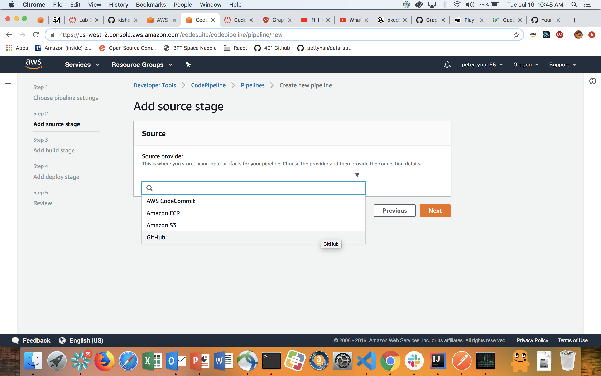
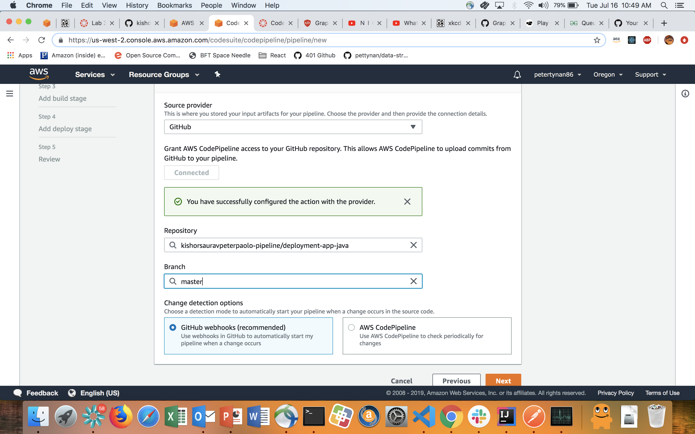
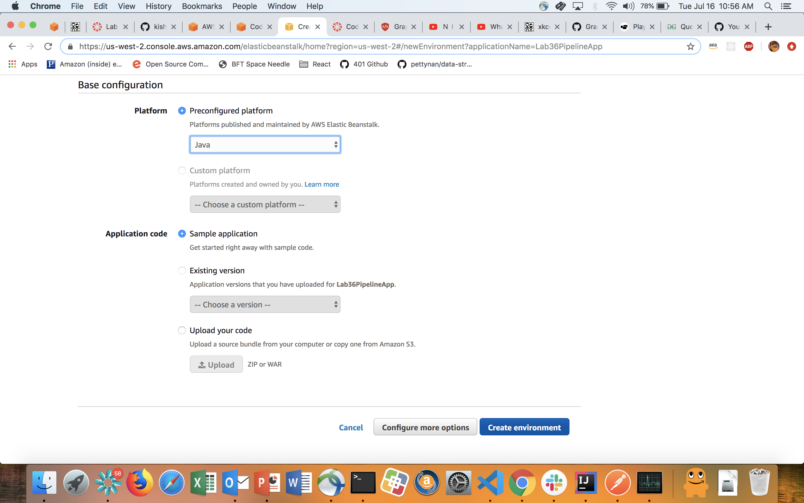
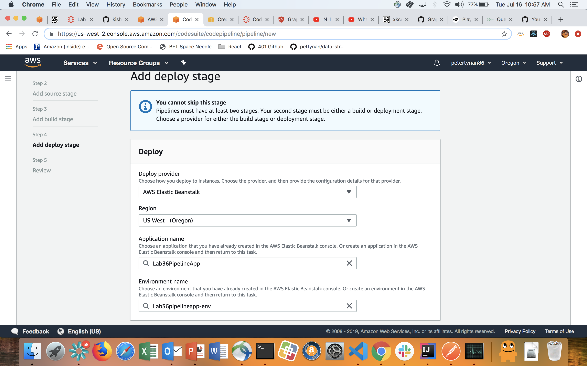
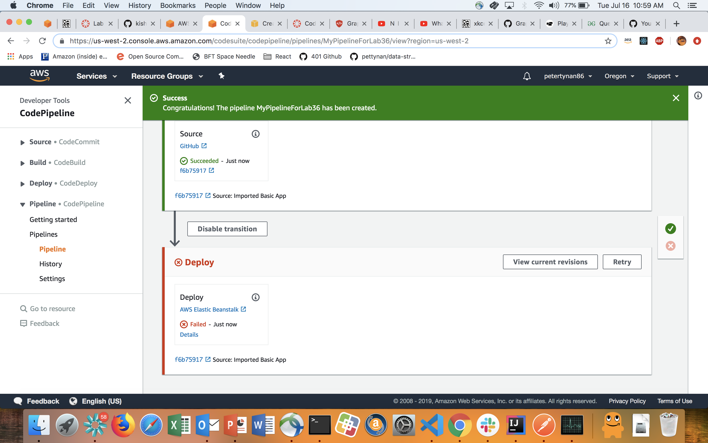
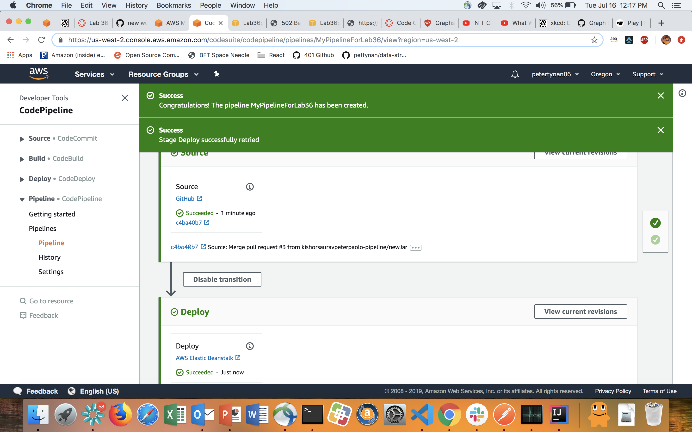
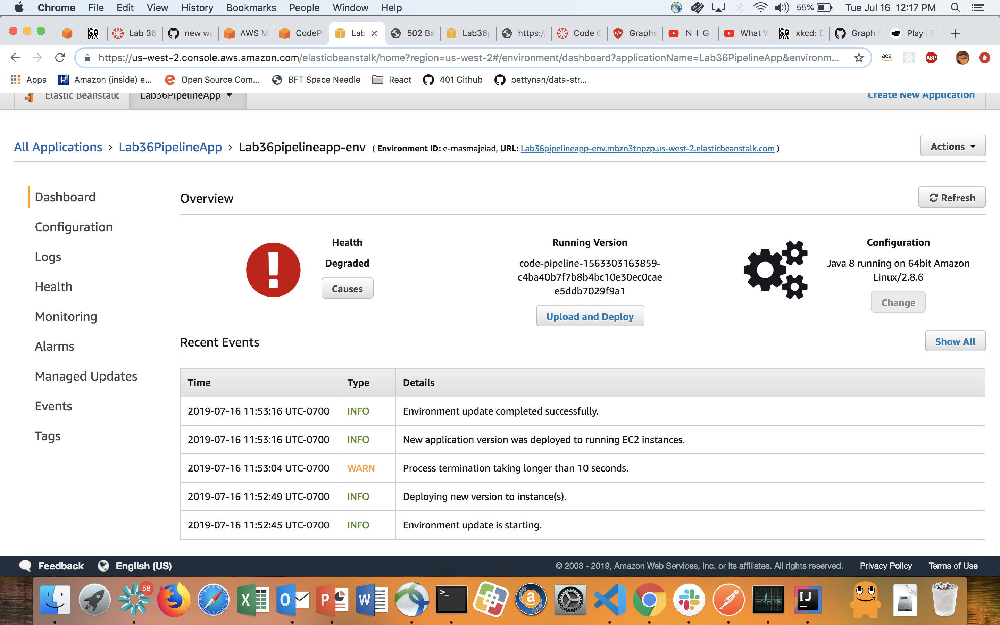

# Implement CI/CD Pipeline

## Featured Tasks

### Deploy Java Spring BootApp

### Link to Deployed link 
> [Deployed Link](http://lab36pipelineapp-env.mbzn3tnpzp.us-west-2.elasticbeanstalk.com/)

* NOTE: It is sucessfully deployed but currently having internal application issuses 

### Steps:
* Clone the repository from class repository
* Go to AWS Console
* Search for AWS pipeline
* Create Name for the pipeline
* Add Source Stage

* Link Source Stage with GitHub

* At this point you should be completed with build stage
* Open Elastic Bean console
* Create a new Base Configuration based on Application language(Java in our case)

* Create Environment
* Go Back to the pipeline console
* On deploy stage, add the Elastic Bean you just created

* Review and deploy

## TroubleShooting
* If having issue with running ‘ ./gradlew jar ‘ on the cloned repo from the GitHub
Then enter following command

chmod a+x ./gradlew
* Run ./gradlew bootJar
* Rename the jar file "application.jar
"
* Check the .gitignore and make sure to remove "/build/"

## Screenshot of a “green” pipeline

## Screenshot of eb

